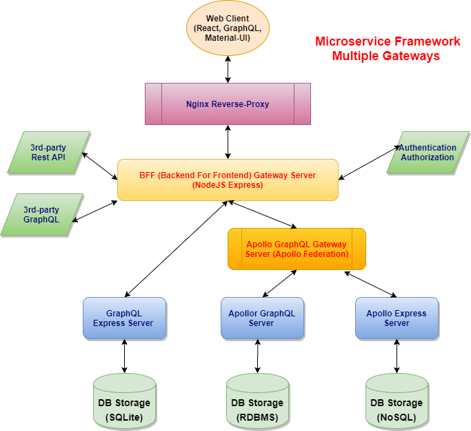
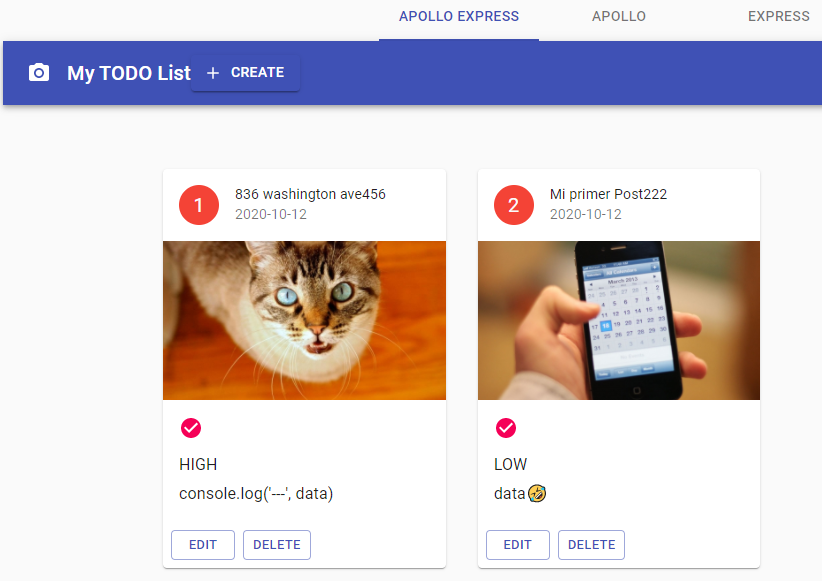
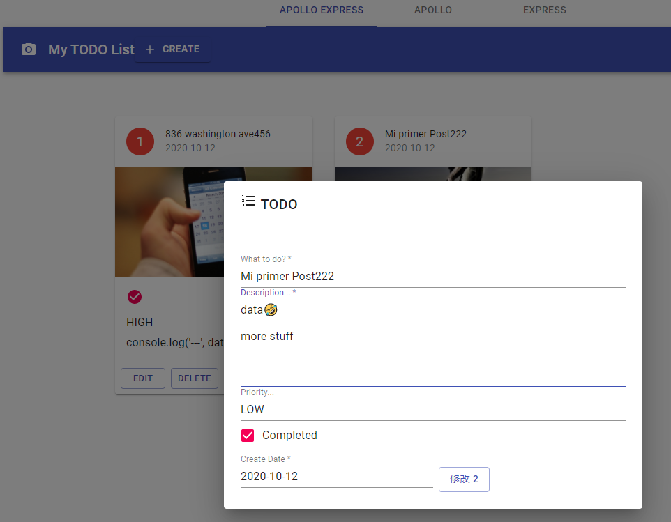
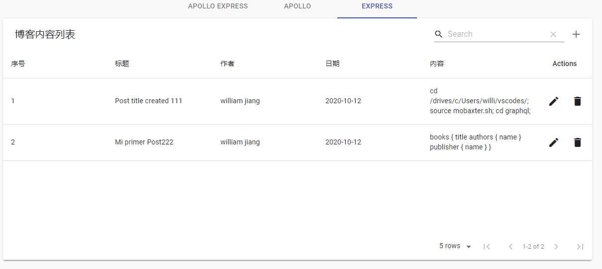
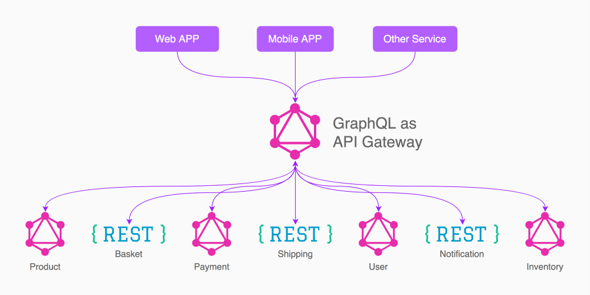

## Framework



## Client

---

- GraphQL
- Apollo/Client
- Material-ui
- React-router
- React-hook-form

## Backend

---

- `gateway` microservice as `BFF` (backend for frontend) server
- 3 micro-service implementation (see below)
- `gitbook` documentary

### microservice 1: Apollo Server

---

- GraphQL
- `Apollo-server` webserver
- `Apollo/Federation` as gateway server
- `SQLite3` datasource
- `Sequelize` middleware

### microservice 2: Apollo Express Server

---

- GraphQL
- `apollo-server-express` webserver
- `Apollo/Federation` as gateway server
- `SQLite3` datasource
- `Sequelize` middleware

### microservice 3: Express Server

---

- GraphQL
- `express` webserver
- `express-graphql` middleware
- `SQLite3` datasource
- `Sequelize` middleware

## Quick start

---

```shell script
$ git clone https://github.com/jxjwilliam/ms-apollo-graphql.git
$ cd ms-apollo-graphql
$ yarn install (respectfully install dependencies under client/, gateway/, express/, apollo-express/)
$ yarn start
$ open http://localhost:3000
```

### URLs

---

- client: <http://localhost:3000/>
- gateway: <http://localhost:8621/>
- express: <http://localhost:8626/graphql>
- apollo: <http://localhost:8628/graphql>

### 1. gateway

---

- @apollo/gateway
- apollo-server

### 2. express (blogs)

---

- express-graphql: 462,203, [graphql/express-graphql](https://github.com/graphql/express-graphql)
- sqlite3
- a micro-service of federation gateway
- schema: input, query, mutation
- resolvers: all the CRUD implementation

### 3. apollo-express (todos)

---

Version `2.0` of `src/express`

- apollo-server-express: 731,636, [apollo-server-express](https://github.com/apollographql/apollo-server/tree/main/packages/apollo-server-express)
- @apollo/federation
- apollographql gateway
- apollographql server + client
- react, react-hook-form
- material-ui
- sqlite3
- `crud` full implementation.
- NO extra dependencies and resource.

### 4. apollo (author, book, user)

---

- apollo-server
- apollo-datasource
- @apollo/federation
- sqlite3 / sequelize

### 5. client

---

- @apollo/client, graphql
- Material-UI
- http-proxy-middleware
- react-hook-form

e.g, for `todo`:

- Todo -> Blog: gql-query-mutation-stuff
- CardList -> List: using `Album` to replace `Material-Table`
- HookForm + Dialog -> DialogForm
- HookForm -> react-hook-form ()
- Dialog -> popup dialog to display CRUD

### 5. As a whole

---

- eslint + prettier + airbnb
- concurrently

## Advantages

---

- The app is all-self-contained, no extra resource (like DB server) are needed, so it's convenient for deployment.
- `CRUD` totally implmented
- microservices

## Demo screenshots

### Menu1



### Menu2



### Menu3



### Menu4


## Resource

---

- [apollo graphql fullstack tutorial](https://github.com/apollographql/fullstack-tutorial)

- [Setup ESLint, Prettier & Airbnb Style Guide in under 2 Minutes](https://github.com/paulolramos/eslint-prettier-airbnb-react)

- [sqlite3, express, graphql, react](https://github.com/jgilbertcastro/micro-blog)

- Apollo Federation Gateway Server:
  
